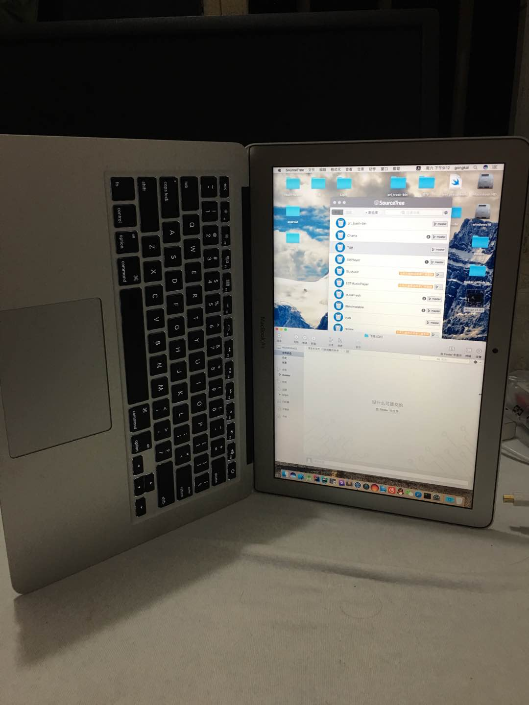
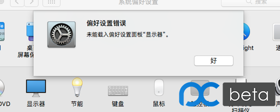

 ---
layout: post
title: "#技巧5# UIWebView BaseURL无效"
date: 2016-11-12
comments: true
categories: 随手一记
sharing: false
---

昨天双11买了台DELL的显示器，晚上到了之后兴奋地想体验下竖屏撸码，于是在Air的桌面操作了 `设置 -> 显示器 -> 缩放 -> 旋转90度`（注意，我操作的是Air的桌面显示器设置，应该操作外接显示器中显示的窗口），之后外接显示屏没有旋转，Air的桌面旋转了，于是就悲剧了，退出设置后重新点显示器，显示 `未能载入偏好设置面板 显示器`错误，此时Air屏幕也是旋转的，如下。。。。

最后准备重装系统时，在[这里](http://tieba.baidu.com/p/3610507120)了解到可以依赖软件手动旋转回来，使用[Pivot](http://soft.macx.cn/5906.htm)即可。

